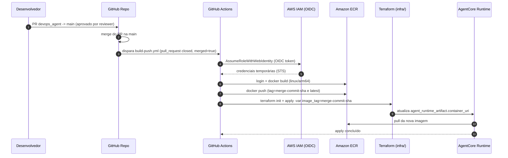
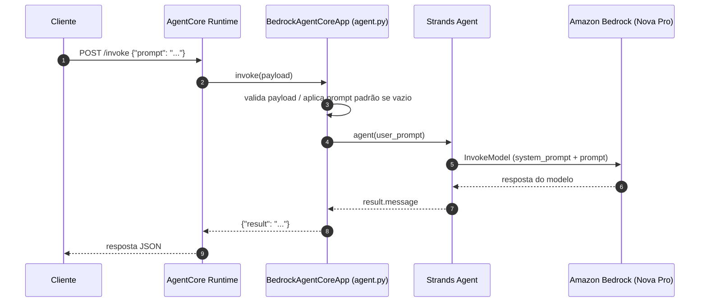
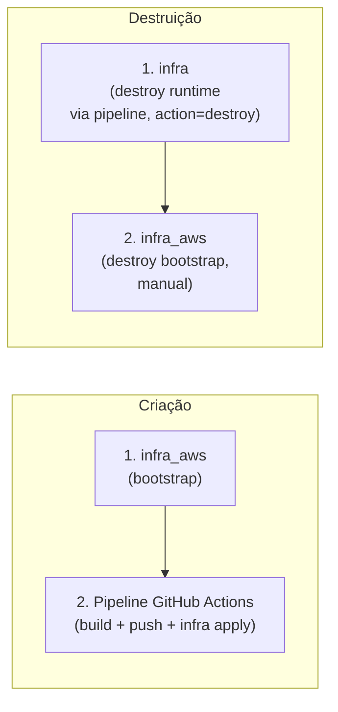

# Arquitetura — AgentCore Easy Deploy

Este documento detalha a arquitetura do projeto: componentes de infraestrutura, fluxo de deploy (CI/CD) e fluxo de execução (runtime) do agente.

## Visão Geral (componentes)

```mermaid
flowchart TB
    subgraph GH["GitHub"]
        Repo["Repositório\nAgentCore-Easy-Deploy"]
        Actions["GitHub Actions\n(build-push.yml)"]
    end

    subgraph AWS["AWS Account"]
        subgraph Bootstrap["infra_aws/ (bootstrap)"]
            OIDC["IAM OIDC Provider\ntoken.actions.githubusercontent.com"]
            Role["IAM Role\ngithub-actions-ecr"]
            ECR["Amazon ECR\nagent_ecr"]
            S3State["S3 Bucket\nagent-runtime-state\n(Terraform state)"]
            S3Diagrams["S3 Bucket\nagent-diagrams-*\n(diagramas .drawio)"]
            GitHubSecret["Secrets Manager\nagentcore-easy-deploy/github-token"]
        end

        subgraph Runtime["infra/ (runtime)"]
            RuntimeRole["IAM Role\nbedrock-agent-runtime-role-*"]
            AgentRuntime["AgentCore Runtime\n(awscc_bedrockagentcore_runtime)"]
        end

        Bedrock["Amazon Bedrock\nNova Pro (apac.amazon.nova-pro-v1:0)"]
        CloudWatch["CloudWatch Logs"]
    end

    Client["Cliente / Invocador\n(payload JSON: prompt)"]

    Repo -->|PR devops_agent -> main\naprovado + merge (paths: src/**)| Actions
    Repo -.->|workflow_dispatch\naction=destroy| Actions
    Actions -->|assume role via OIDC| OIDC
    OIDC --> Role
    Actions -->|docker build + push\n(linux/arm64)| ECR
    Actions -->|terraform apply/destroy\n(infra/)| AgentRuntime
    AgentRuntime -->|pull image| ECR
    AgentRuntime -->|assume| RuntimeRole
    RuntimeRole -->|bedrock:InvokeModel| Bedrock
    RuntimeRole -->|logs:PutLogEvents| CloudWatch
    RuntimeRole -->|secretsmanager:GetSecretValue| GitHubSecret
    RuntimeRole -->|s3:PutObject/GetObject| S3Diagrams
    Role -->|s3:GetObject/PutObject| S3State

    Client -->|HTTPS invoke| AgentRuntime
    AgentRuntime -->|resposta JSON: result| Client
```

## Fluxo de Deploy (CI/CD)



O workflow também expõe um disparo manual (`workflow_dispatch`) com dois modos:

- `action=apply`: repete o fluxo acima (build + push + terraform apply) sem depender de um PR.
- `action=destroy`: pula build/push e executa apenas `terraform destroy` em `infra/`, protegido pelo Environment `destroy-approval` (aprovação manual obrigatória).

## Fluxo de Execução (Runtime do Agente)



## Camadas e Responsabilidades

| Camada | Diretório | Responsabilidade |
|---|---|---|
| Bootstrap | [infra_aws/](infra_aws) | Cria pré-requisitos que só existem uma vez: ECR, bucket de state, IAM Role + OIDC do GitHub Actions, bucket S3 de diagramas e o secret do GitHub token (o `infra/` apenas referencia esses recursos via `data` sources) |
| Runtime (IaC) | [infra/](infra) | Provisiona o `AgentCore Runtime` e a IAM Role que ele assume para chamar o Bedrock e puxar imagem do ECR |
| Aplicação | [src/](src) | Código do agente (Strands + BedrockAgentCore), `Dockerfile` e dependências |
| CI/CD | [.github/workflows/](.github/workflows) | Builda a imagem, publica no ECR e aplica o Terraform do runtime quando um PR `devops_agent → main` é aprovado/mergeado; também permite `apply`/`destroy` manuais via `workflow_dispatch` |

## Rede e Segurança (estado atual)

- `network_configuration.network_mode = "PUBLIC"` no [infra/agentcore_runtime.tf](infra/agentcore_runtime.tf) — o runtime é acessível publicamente (sem VPC privada).
- Autenticação da pipeline via **OIDC** (sem chaves de acesso estáticas no GitHub).
- State do Terraform armazenado remotamente em S3 ([infra/versions.tf](infra/versions.tf)), sem lock (DynamoDB) — ver [UPDATE.MD](UPDATE.MD) para melhorias recomendadas.

## Ordem de Provisionamento e Destruição



Para detalhes de deploy passo a passo, consulte o [README.MD](README.MD). Para melhorias e débitos técnicos planejados, consulte o [UPDATE.MD](UPDATE.MD).
