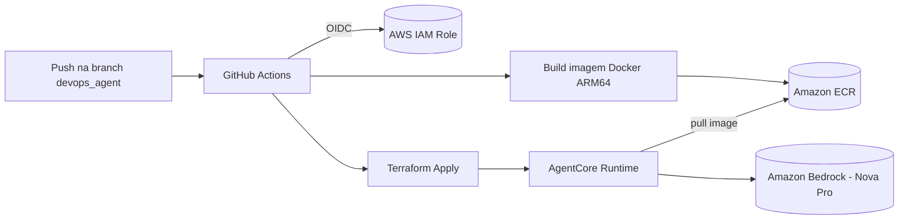

# AgentCore Easy Deploy

Deploy automatizado de um agente de IA (AWS Bedrock AgentCore + Strands Agents) especialista em **dados geográficos**, com infraestrutura como código (Terraform) e pipeline de CI/CD (GitHub Actions) para build, push e atualização do runtime.

## Sumário

- [Visão Geral](#visão-geral)
- [Arquitetura](#arquitetura)
- [Estrutura do Projeto](#estrutura-do-projeto)
- [Pré-requisitos](#pré-requisitos)
- [Como Funciona o Agente](#como-funciona-o-agente)
- [Deploy — Passo a Passo](#deploy--passo-a-passo)
- [Pipeline de CI/CD](#pipeline-de-cicd)
- [Variáveis e Outputs do Terraform](#variáveis-e-outputs-do-terraform)
- [Destruindo a Infraestrutura](#destruindo-a-infraestrutura)
- [Troubleshooting](#troubleshooting)

## Visão Geral

Este projeto provisiona um **AgentCore Runtime** na AWS (via Amazon Bedrock) que executa um agente de IA construído com [Strands Agents](https://github.com/strands-agents/sdk-python), empacotado em container Docker e hospedado em uma imagem publicada no **Amazon ECR**. Toda a infraestrutura é gerenciada via **Terraform**, dividida em dois módulos independentes (bootstrap e runtime), e o build/deploy do agente é automatizado via **GitHub Actions** usando autenticação **OIDC** (sem chaves de acesso estáticas).

O agente atual é especializado em **dados geográficos** (GIS, coordenadas, projeções, cartografia, sensoriamento remoto, geocoding, etc.), respondendo perguntas nesse domínio via um modelo Bedrock (Amazon Nova Pro).

## Arquitetura



- **`infra_aws/`**: infraestrutura de *bootstrap* — repositório ECR, bucket S3 para state remoto do Terraform e a IAM Role usada pelo GitHub Actions via OIDC.
- **`infra/`**: infraestrutura do *runtime* — recurso `awscc_bedrockagentcore_runtime`, IAM Role/Policy assumida pelo runtime para invocar o Bedrock e puxar a imagem do ECR.
- **`src/`**: código-fonte do agente (Python) e `Dockerfile` usado para gerar a imagem publicada no ECR.
- **`.github/workflows/`**: pipeline que builda a imagem, publica no ECR e aplica o Terraform do runtime.

## Estrutura do Projeto

```
AgentCore-Easy-Deploy/
├── README.MD                     # este arquivo
├── UPDATE.MD                     # melhorias e débitos técnicos identificados
├── .github/
│   └── workflows/
│       └── build-push.yml        # pipeline de build, push e apply
├── src/
│   ├── agent.py                  # agente Strands + BedrockAgentCore
│   ├── Dockerfile                # imagem do agente (Python 3.11 slim)
│   └── requirements.txt          # dependências Python
├── infra_aws/                    # bootstrap (executar primeiro)
│   ├── ecr.tf                    # repositório ECR da imagem do agente
│   ├── github_oidc.tf            # OIDC provider + IAM Role do GitHub Actions
│   ├── s3.tf                     # bucket S3 do state remoto
│   ├── outputs.tf                # ARN da role (AWS_ROLE_ARN)
│   ├── provider.tf
│   └── variables.tf
└── infra/                        # runtime do agente (via pipeline)
    ├── agentcore_runtime.tf       # recurso AgentCore Runtime
    ├── iam.tf                     # IAM Role/Policy do runtime
    ├── data.tf                    # data sources (conta AWS, repo ECR)
    ├── locals.tf                  # nomes com sufixo aleatório
    ├── variables.tf
    ├── outputs.tf
    ├── providers.tf               # providers aws + awscc
    └── versions.tf                # backend S3 + versões dos providers
```

## Pré-requisitos

- Conta AWS com permissões para criar IAM Roles, ECR, S3 e recursos Bedrock AgentCore.
- [Terraform](https://developer.hashicorp.com/terraform) `~> 1.0` instalado localmente (para o bootstrap inicial).
- AWS CLI configurado (`aws configure` ou variáveis de ambiente) com credenciais válidas.
- Acesso habilitado ao modelo **Amazon Nova Pro** no Amazon Bedrock, na região configurada (`ap-south-1` no código do agente).
- Repositório GitHub com permissão para configurar **Actions Variables** (`AWS_ROLE_ARN`).
- Docker (opcional, apenas para build/teste local da imagem).

## Como Funciona o Agente

O agente ([src/agent.py](src/agent.py)) usa:

- **`bedrock_agentcore.BedrockAgentCoreApp`**: expõe o endpoint HTTP do runtime (`@app.entrypoint`).
- **`strands.Agent` + `strands.models.BedrockModel`**: orquestra a chamada ao modelo `apac.amazon.nova-pro-v1:0` na região `ap-south-1`.
- **`SYSTEM_PROMPT`**: define o agente como especialista em dados geográficos (GIS, coordenadas, projeções, cartografia, sensoriamento remoto, geocoding, padrões abertos como GeoJSON/WMS/WFS, entre outros).

**Payload de entrada esperado:**
```json
{
  "prompt": "Qual a diferença entre WGS84 e UTM?"
}
```

**Resposta:**
```json
{
  "result": "<mensagem retornada pelo agente>"
}
```

Se nenhum `prompt` for enviado, o agente usa uma pergunta padrão de exemplo e registra um aviso no log.

## Deploy — Passo a Passo

> ⚠️ A ordem de execução importa: **`infra_aws` primeiro**, depois o pipeline do GitHub Actions cuida do `infra/`.

### 1. Bootstrap (`infra_aws/`) — executado manualmente, uma única vez

```bash
cd infra_aws
terraform init
terraform apply
```

Isso cria:
- Bucket S3 (`agent-runtime-state`) para armazenar o state remoto do Terraform do runtime.
- Repositório ECR (`agent_ecr`) onde a imagem do agente será publicada.
- IAM Role assumida pelo GitHub Actions via OIDC, com permissões para ECR, S3 (state), IAM (para o Terraform do runtime), Bedrock/AgentCore e CloudControl (usado pelo provider `awscc`).

Copie o valor do output `github_actions_role_arn` e cadastre-o como **Repository Variable** no GitHub:

```
Settings → Secrets and variables → Actions → Variables → AWS_ROLE_ARN
```

### 2. Pipeline (GitHub Actions) — automático a cada push em `devops_agent`

O workflow [build-push.yml](.github/workflows/build-push.yml) é disparado por push na branch `devops_agent` (quando arquivos em `src/**` mudam) ou manualmente (`workflow_dispatch`). Ele:

1. Autentica na AWS via OIDC (assume `AWS_ROLE_ARN`).
2. Faz login no ECR.
3. Builda a imagem Docker para `linux/arm64` (com QEMU + Buildx).
4. Publica a imagem no ECR com as tags `<commit-sha>` e `latest`.
5. Executa `terraform init` + `terraform apply` no diretório `infra/`, passando `image_tag=<commit-sha>` para atualizar o AgentCore Runtime com a nova imagem.

### 3. Execução manual do `infra/` (alternativa ao pipeline)

```bash
cd infra
terraform init
terraform apply -var="image_tag=<tag-da-imagem>"
```

## Pipeline de CI/CD

| Etapa | Ferramenta | Descrição |
|---|---|---|
| Autenticação | OIDC (`aws-actions/configure-aws-credentials`) | Sem chaves de acesso estáticas armazenadas no GitHub |
| Build | Docker Buildx + QEMU | Build multi-arch, imagem final `linux/arm64` |
| Publicação | Amazon ECR | Tags `latest` e `<commit-sha>` |
| Infraestrutura | Terraform (`infra/`) | Atualiza o AgentCore Runtime com a nova imagem |

## Variáveis e Outputs do Terraform

**`infra_aws/variables.tf`**
| Variável | Default | Descrição |
|---|---|---|
| `build_branch` | `devops_agent` | Branch usada como referência de build |
| `aws_region` | `us-east-1` | Região AWS do bootstrap |

**`infra_aws/outputs.tf`**
| Output | Descrição |
|---|---|
| `github_actions_role_arn` | ARN da role a ser usada como `AWS_ROLE_ARN` no GitHub |

**`infra/variables.tf`**
| Variável | Default | Descrição |
|---|---|---|
| `project_name` | `agentcore_easy_deploy` | Prefixo usado nos nomes dos recursos |
| `aws_region` | `us-east-1` | Região AWS do runtime |
| `image_tag` | `latest` | Tag da imagem no ECR usada pelo runtime |

## Destruindo a Infraestrutura

A ordem de destruição é **inversa** à de criação (`infra` → `infra_aws`), pois o runtime depende dos recursos de bootstrap (ECR, state):

```bash
# 1. Destruir o runtime primeiro
cd infra
terraform destroy

# 2. Depois destruir o bootstrap
cd ../infra_aws
terraform destroy
```

## Troubleshooting

- **Erro de autenticação Git (push/clone)**: verifique se está usando um *Personal Access Token* válido (senha de conta não é mais aceita pelo GitHub) ou uma chave SSH configurada.
- **`No anonymous write access`**: o push exige autenticação mesmo em repositórios públicos — a visibilidade pública garante apenas leitura anônima.
- **Falha no `terraform apply` do runtime**: confirme que o `infra_aws` já foi aplicado (ECR e bucket de state precisam existir antes) e que o modelo Bedrock está habilitado na região configurada.

Para melhorias planejadas e débitos técnicos conhecidos, veja [UPDATE.MD](UPDATE.MD).
