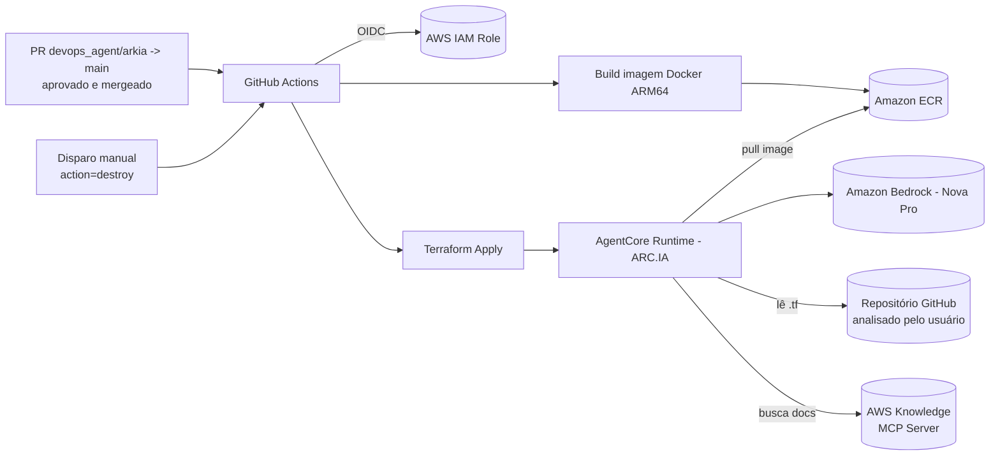

# ARC.IA

**ARC.IA** é um agente de IA (AWS Bedrock AgentCore + Strands Agents) especialista em **arquitetura AWS e boas práticas do Well-Architected Framework**. Ele tem duas capacidades principais:

1. **Geração de diagramas de arquitetura** a partir de um repositório GitHub (ou de um trecho de código Terraform colado diretamente) — o diagrama é montado **deterministicamente** a partir do Terraform real (nunca desenhado "de cabeça" pelo modelo), usando os ícones oficiais da AWS, e exportado em formato `.drawio`.
2. **Recomendações de boas práticas arquiteturais**, sempre fundamentadas na documentação oficial da AWS (incluindo o Well-Architected Framework), consultada em tempo real — nunca apenas "de memória" do modelo.

> Nome anterior do projeto: `AgentCore-Easy-Deploy`. A infraestrutura (Terraform) e o pipeline de CI/CD continuam os mesmos; o que muda é o propósito do agente.

## Sumário

- [Visão Geral](#visão-geral)
- [Arquitetura](#arquitetura)
- [Estrutura do Projeto](#estrutura-do-projeto)
- [Pré-requisitos](#pré-requisitos)
- [Como Funciona o Agente](#como-funciona-o-agente)
- [Configurando o Acesso ao GitHub](#configurando-o-acesso-ao-github)
- [Deploy — Passo a Passo](#deploy--passo-a-passo)
- [Pipeline de CI/CD](#pipeline-de-cicd)
- [Variáveis e Outputs do Terraform](#variáveis-e-outputs-do-terraform)
- [Destruindo a Infraestrutura](#destruindo-a-infraestrutura)
- [Troubleshooting](#troubleshooting)

## Visão Geral

Este projeto provisiona um **AgentCore Runtime** na AWS (via Amazon Bedrock) que executa o **ARC.IA**, um agente de IA construído com [Strands Agents](https://github.com/strands-agents/sdk-python), empacotado em container Docker e hospedado em uma imagem publicada no **Amazon ECR**. Toda a infraestrutura é gerenciada via **Terraform**, dividida em dois módulos independentes (bootstrap e runtime), e o build/deploy do agente é automatizado via **GitHub Actions** usando autenticação **OIDC** (sem chaves de acesso estáticas).

O ARC.IA combina duas fontes de verdade, nunca o modelo sozinho:

- **Terraform real do repositório analisado** (via GitHub API) → parseado deterministicamente → renderizado como diagrama `.drawio` com ícones oficiais da AWS.
- **Documentação oficial da AWS** (incluindo Well-Architected) → consultada via o [AWS Knowledge MCP Server](https://github.com/awslabs/mcp/tree/main/src/aws-knowledge-mcp-server) → usada para fundamentar toda recomendação, sempre citando a URL da fonte.

## Arquitetura



- **`infra_aws/`**: infraestrutura de *bootstrap* — repositório ECR, bucket S3 para state remoto do Terraform, bucket S3 para os diagramas `.drawio` gerados pelo agente, secret no Secrets Manager para o GitHub token e a IAM Role usada pelo GitHub Actions via OIDC.
- **`infra/`**: infraestrutura do *runtime* — recurso `awscc_bedrockagentcore_runtime`, IAM Role/Policy assumida pelo runtime para invocar o Bedrock, ler o GitHub token e escrever diagramas no S3.
- **`src/`**: código-fonte do agente (Python) e `Dockerfile` usado para gerar a imagem publicada no ECR.
- **`.github/workflows/`**: pipeline que builda a imagem, publica no ECR e aplica o Terraform do runtime.

Para diagramas detalhados (componentes, fluxo de geração de diagrama e fluxo de boas práticas), veja [ARCH.md](ARCH.md).

## Estrutura do Projeto

```
ARC.IA/
├── README.MD                     # este arquivo
├── ARCH.md                       # arquitetura detalhada (diagramas Mermaid)
├── UPDATE.MD                     # melhorias e débitos técnicos identificados
├── .github/
│   └── workflows/
│       └── build-push.yml        # pipeline de build, push e apply
├── src/
│   ├── agent.py                  # agente Strands + BedrockAgentCore (entrypoint, tools, MCP)
│   ├── diagram_service.py        # orquestra parser -> drawio_builder -> upload S3
│   ├── terraform_parser.py       # parser determinístico de blocos `resource` (.tf)
│   ├── drawio_builder.py         # gera o XML .drawio (layout por grafo de dependências)
│   ├── aws_icon_map.py           # mapeia tipo de recurso Terraform -> ícone/categoria AWS
│   ├── github_client.py          # cliente REST da API do GitHub (leitura de repositórios)
│   ├── Dockerfile                # imagem do agente (Python 3.11 slim)
│   └── requirements.txt          # dependências Python
├── infra_aws/                    # bootstrap (executar primeiro)
│   ├── ecr.tf                    # repositório ECR da imagem do agente
│   ├── github_oidc.tf            # OIDC provider + IAM Role do GitHub Actions
│   ├── s3.tf                     # bucket S3 do state remoto
│   ├── diagram_storage.tf        # bucket S3 de diagramas + secret do GitHub token
│   ├── outputs.tf                # ARN da role, bucket de diagramas, secret
│   ├── provider.tf
│   └── variables.tf
└── infra/                        # runtime do agente (via pipeline)
    ├── agentcore_runtime.tf       # recurso AgentCore Runtime
    ├── iam.tf                     # IAM Role/Policy do runtime
    ├── data.tf                    # data sources (conta AWS, repo ECR, bucket/secret do bootstrap)
    ├── locals.tf                  # nomes com sufixo aleatório
    ├── variables.tf
    ├── outputs.tf
    ├── providers.tf               # providers aws + awscc
    └── versions.tf                # backend S3 + versões dos providers
```

## Pré-requisitos

- Conta AWS com permissões para criar IAM Roles, ECR, S3, Secrets Manager e recursos Bedrock AgentCore.
- [Terraform](https://developer.hashicorp.com/terraform) `~> 1.0` instalado localmente (para o bootstrap inicial).
- AWS CLI configurado (`aws configure` ou variáveis de ambiente) com credenciais válidas.
- Acesso habilitado ao modelo **Amazon Nova Pro** no Amazon Bedrock, na região configurada (`ap-south-1` no código do agente).
- Repositório GitHub com permissão para configurar **Actions Variables** (`AWS_ROLE_ARN`).
- Um **GitHub Personal Access Token** (escopo `Contents: Read-only`, ou `repo`/`public_repo` no formato clássico) para o agente conseguir ler os repositórios que ele vai analisar — veja [Configurando o Acesso ao GitHub](#configurando-o-acesso-ao-github).
- Docker (opcional, apenas para build/teste local da imagem).

## Como Funciona o Agente

O agente ([src/agent.py](src/agent.py)) expõe três capacidades, com uma regra central: **o conteúdo factual nunca vem só do modelo** — vem de parsing determinístico de Terraform ou de documentação oficial da AWS consultada em tempo real.

1. **Geração de diagrama a partir de um repositório GitHub** (`generate_diagram_from_github`): lê os arquivos `.tf`/`.tf.json` do repositório via [github_client.py](src/github_client.py), parseia os blocos `resource` e as referências entre eles ([terraform_parser.py](src/terraform_parser.py)), e renderiza um diagrama `.drawio` ([drawio_builder.py](src/drawio_builder.py)) com layout em camadas por dependência (quem referencia o quê), ícones oficiais AWS4 ([aws_icon_map.py](src/aws_icon_map.py)) e uma legenda de categorias.
2. **Geração de diagrama a partir de um trecho Terraform colado** (`generate_diagram_from_terraform`): mesmo pipeline determinístico, sem precisar de acesso ao GitHub.
3. **Boas práticas / Well-Architected**: quando o usuário pergunta se algo é uma boa prática, pede uma recomendação ou uma revisão, o agente consulta o **AWS Knowledge MCP Server** (`search_documentation`/`read_documentation`, servidor MCP público mantido pela AWS) e responde citando a(s) URL(s) da documentação usada — nunca apresenta uma opinião do modelo como se fosse uma recomendação oficial da AWS.

Um **caminho rápido determinístico** identifica automaticamente um `owner/repo` (por payload explícito ou por regex no prompt) e gera o diagrama sem passar pelo LLM; o LLM só entra em cena para orquestrar chamadas de ferramenta e para a análise de boas práticas.

**Payload de entrada esperado (exemplos):**
```json
{"owner": "minha-org", "repo_name": "minha-infra", "ref": "main"}
```
```json
{"prompt": "gera o diagrama de arquitetura do github.com/minha-org/minha-infra e me diz se o S3 está seguindo boas práticas"}
```
```json
{"terraform_code": "resource \"aws_lambda_function\" \"fn\" { ... }"}
```

**Resposta (geração de diagrama):**
```json
{
  "result": "Analyzed owner/repo (main): found N AWS resource(s)...",
  "diagram": {"format": "drawio", "xml": "...", "download_url": "https://..."},
  "resources": [{"id": "...", "type": "...", "name": "...", "category": "..."}],
  "recommendations": "(presente apenas se o prompt pediu boas práticas, com citações da documentação oficial)"
}
```

Se nenhum `prompt`, `owner/repo` ou `terraform_code` for enviado, o agente pede ao usuário as informações necessárias em vez de assumir algo.

## Configurando o Acesso ao GitHub

O agente lê repositórios via API REST do GitHub, autenticado com um token guardado no Secrets Manager (nunca no código ou no state do Terraform).

1. Gere um **fine-grained personal access token** em `github.com/settings/personal-access-tokens/new`, com **Repository access** limitado aos repositórios desejados e permissão **Contents: Read-only** (suficiente — o agente só lê árvore de arquivos e conteúdo). Alternativamente, um token clássico com escopo `repo` (privados + públicos) ou `public_repo` (apenas públicos).
2. Após o bootstrap (`infra_aws/`) ser aplicado, popule o secret criado (fora do Terraform, o valor nunca passa pelo state):

```bash
aws secretsmanager put-secret-value \
  --secret-id agentcore-easy-deploy/github-token \
  --secret-string "<seu-token-aqui>"
```

Sem token configurado, o agente ainda funciona, mas apenas para repositórios **públicos** e com rate limit reduzido (chamadas não autenticadas da API do GitHub).

## Deploy — Passo a Passo

> ⚠️ A ordem de execução importa: **`infra_aws` primeiro**, depois o pipeline do GitHub Actions cuida do `infra/`.

### 1. Bootstrap (`infra_aws/`) — executado manualmente, uma única vez

```bash
cd infra_aws
terraform init
terraform apply
```

Isso cria:
- Bucket S3 (`agent-runtime-state`) para armazenar o state remoto do Terraform do runtime.
- Bucket S3 (`agent-diagrams-<account-id>`) onde o agente salva os diagramas `.drawio` gerados.
- Secret no Secrets Manager (`agentcore-easy-deploy/github-token`) — populado manualmente com um GitHub PAT (ver [Configurando o Acesso ao GitHub](#configurando-o-acesso-ao-github)).
- Repositório ECR (`agent_ecr`) onde a imagem do agente será publicada.
- IAM Role assumida pelo GitHub Actions via OIDC, com permissões para ECR, S3 (state), IAM (para o Terraform do runtime), Bedrock/AgentCore e CloudControl (usado pelo provider `awscc`).

Copie o valor do output `github_actions_role_arn` e cadastre-o como **Repository Variable** no GitHub:

```
Settings → Secrets and variables → Actions → Variables → AWS_ROLE_ARN
```

### 2. Pipeline (GitHub Actions) — automático quando um PR `devops_agent`/`arkia` → `main` é aprovado e mergeado

O workflow [build-push.yml](.github/workflows/build-push.yml) é disparado quando um **Pull Request originado das branches `devops_agent` ou `arkia` para `main`** é fechado com merge (evento `pull_request` / `types: closed`, checando `merged == true`), desde que arquivos em `src/**` tenham mudado. Para que isso represente de fato um PR **aprovado**, configure uma *branch protection rule* na branch `main` exigindo pelo menos 1 aprovação de review antes do merge:

```
Settings → Branches → Branch protection rules → main → Require a pull request before merging → Require approvals
```

Job `build-push`, executado nesse cenário (ou via `workflow_dispatch` com `action=apply`):

1. Autentica na AWS via OIDC (assume `AWS_ROLE_ARN`).
2. Faz login no ECR.
3. Builda a imagem Docker para `linux/arm64` (com QEMU + Buildx).
4. Publica a imagem no ECR com as tags `<commit-sha>` e `latest`.
5. Executa `terraform init` + `terraform apply` no diretório `infra/`, passando `image_tag=<commit-sha>` para atualizar o AgentCore Runtime com a nova imagem.

O workflow também pode ser disparado manualmente (`workflow_dispatch`), escolhendo a ação `apply` (mesmo fluxo acima) ou `destroy` (ver seção [Destruindo a Infraestrutura](#destruindo-a-infraestrutura)).

### 3. Execução manual do `infra/` (alternativa ao pipeline)

```bash
cd infra
terraform init
terraform apply -var="image_tag=<tag-da-imagem>"
```

## Pipeline de CI/CD

| Etapa | Ferramenta | Descrição |
|---|---|---|
| Autenticação | OIDC (`aws-actions/configure-aws-credentials`) | Sem chaves de acesso estáticas armazenadas no GitHub |
| Build | Docker Buildx + QEMU | Build multi-arch, imagem final `linux/arm64` |
| Publicação | Amazon ECR | Tags `latest` e `<commit-sha>` |
| Infraestrutura | Terraform (`infra/`) | Atualiza o AgentCore Runtime com a nova imagem |

## Variáveis e Outputs do Terraform

**`infra_aws/variables.tf`**
| Variável | Default | Descrição |
|---|---|---|
| `build_branch` | `devops_agent` | Branch usada como referência de build |
| `aws_region` | `us-east-1` | Região AWS do bootstrap |

**`infra_aws/outputs.tf`**
| Output | Descrição |
|---|---|
| `github_actions_role_arn` | ARN da role a ser usada como `AWS_ROLE_ARN` no GitHub |
| `diagram_bucket_name` | Nome do bucket S3 onde os diagramas `.drawio` gerados pelo agente são salvos |
| `github_token_secret_arn` | ARN do secret no Secrets Manager a ser populado com o GitHub PAT |

**`infra/variables.tf`**
| Variável | Default | Descrição |
|---|---|---|
| `project_name` | `agentcore_easy_deploy` | Prefixo usado nos nomes dos recursos |
| `aws_region` | `us-east-1` | Região AWS do runtime |
| `image_tag` | `latest` | Tag da imagem no ECR usada pelo runtime |

**Variáveis de ambiente do runtime (`agentcore_runtime.tf`)**
| Variável | Origem | Descrição |
|---|---|---|
| `GITHUB_TOKEN_SECRET_ARN` | `data.aws_secretsmanager_secret.github_token` | ARN do secret com o GitHub PAT usado por [github_client.py](src/github_client.py) |
| `DIAGRAM_BUCKET_NAME` | `data.aws_s3_bucket.diagrams` | Bucket onde os `.drawio` gerados são salvos para gerar URL pré-assinada |
| `AWS_KNOWLEDGE_MCP_URL` | *(opcional, default `https://knowledge-mcp.global.api.aws`)* | Endpoint do AWS Knowledge MCP Server usado para boas práticas |

## Destruindo a Infraestrutura

A ordem de destruição é **inversa** à de criação (`infra` → `infra_aws`), pois o runtime depende dos recursos de bootstrap (ECR, state, bucket de diagramas, secret do GitHub token).

### Via pipeline (recomendado — mantém tudo gerenciado pelo GitHub Actions)

O runtime (`infra/`) pode ser destruído diretamente pelo workflow [build-push.yml](.github/workflows/build-push.yml):

```
Actions → Build, Push & Terraform (infra/) → Run workflow → action: destroy
```

Isso executa `terraform destroy` no diretório `infra/` usando as mesmas credenciais OIDC do pipeline. Por segurança, o job `destroy` referencia o Environment `destroy-approval` — configure-o em `Settings → Environments` com *required reviewers* para exigir uma aprovação manual antes da execução:

```
Settings → Environments → New environment → destroy-approval → Required reviewers
```

> O bootstrap (`infra_aws/`) continua sendo destruído manualmente (ver abaixo), pois ele contém o próprio ECR, o bucket de state, o bucket de diagramas e o secret do GitHub token usados pelo pipeline e pelo runtime.

### Manual

```bash
# 1. Destruir o runtime primeiro
cd infra
terraform destroy

# 2. Depois destruir o bootstrap
cd ../infra_aws
terraform destroy
```

## Troubleshooting

- **Erro de autenticação Git (push/clone)**: verifique se está usando um *Personal Access Token* válido (senha de conta não é mais aceita pelo GitHub) ou uma chave SSH configurada.
- **`No anonymous write access`**: o push exige autenticação mesmo em repositórios públicos — a visibilidade pública garante apenas leitura anônima.
- **`Could not read repository ... (HTTP 404)`**: confira o nome exato do `owner`/`repo` (erro de digitação é a causa mais comum) e, se for um repositório privado, confirme que o secret `agentcore-easy-deploy/github-token` está populado com um PAT com escopo `repo` (não apenas `public_repo`).
- **Pipeline não disparou após o merge do PR**: o `build-push.yml` só roda para PRs cuja branch de origem (`head.ref`) seja `devops_agent` ou `arkia` e cujo destino seja `main`, com mudanças em `src/**`. Um PR de outra branch é ignorado (job aparece como *skipped*).
- **Falha no `terraform apply` do runtime**: confirme que o `infra_aws` já foi aplicado (ECR, bucket de state, bucket de diagramas e secret do GitHub token precisam existir antes) e que o modelo Bedrock está habilitado na região configurada.

Para melhorias planejadas e débitos técnicos conhecidos, veja [UPDATE.MD](UPDATE.MD). Para diagramas de arquitetura detalhados, veja [ARCH.md](ARCH.md).
